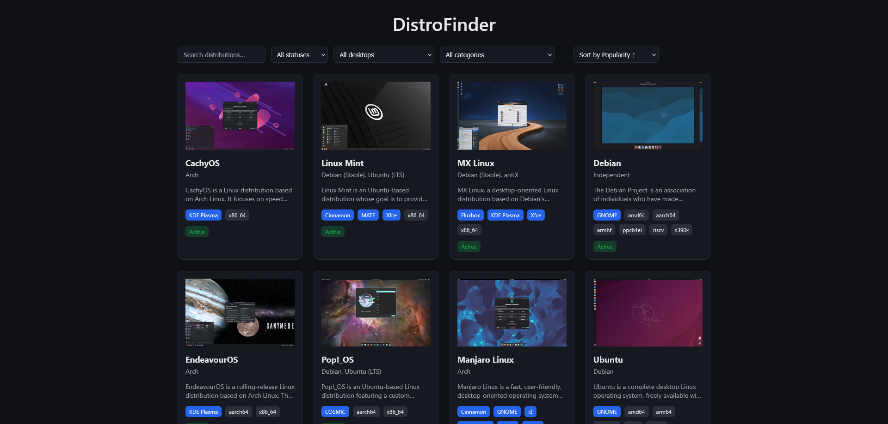
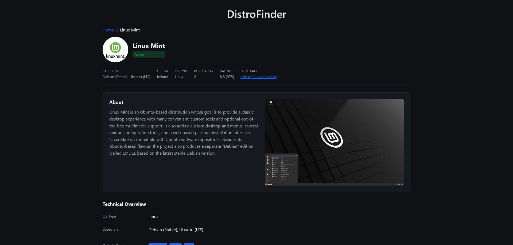
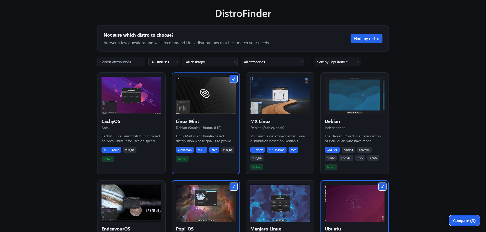
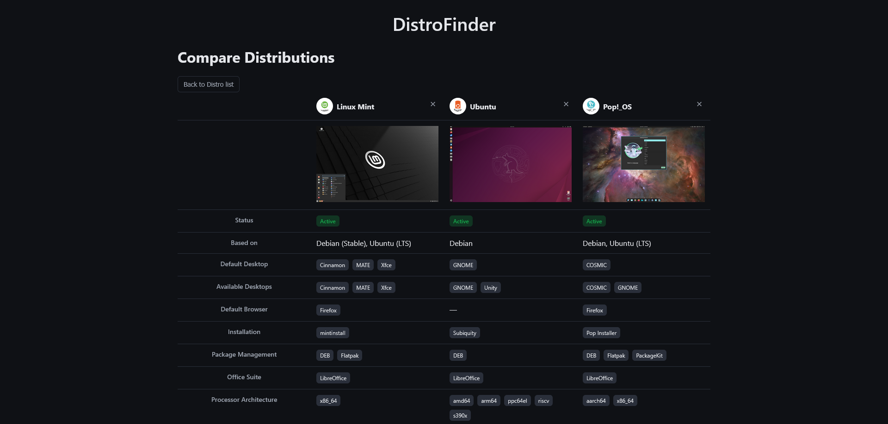
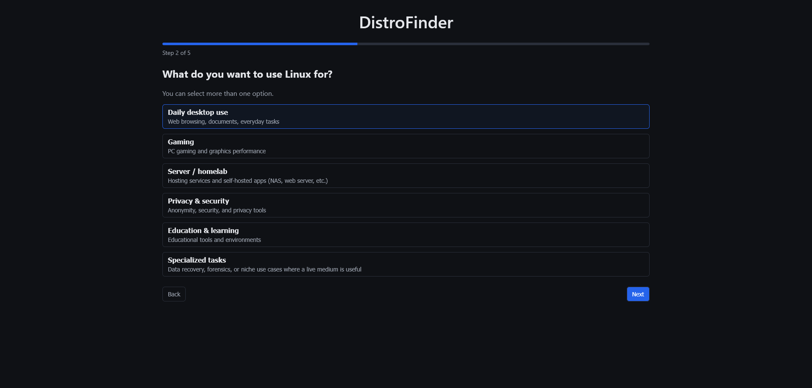
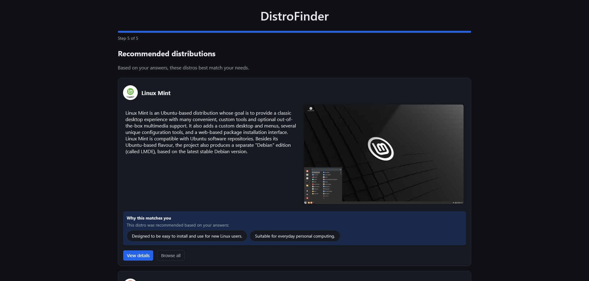
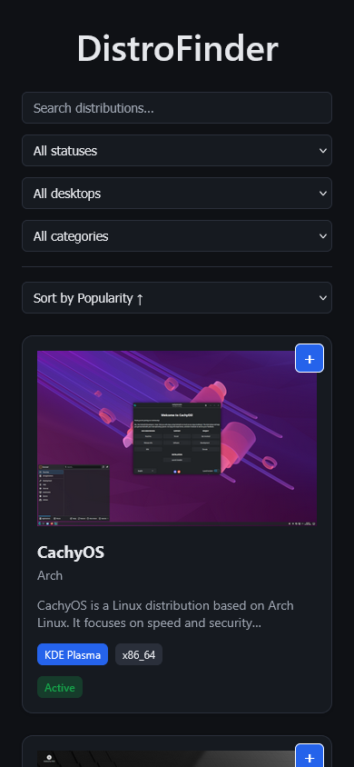
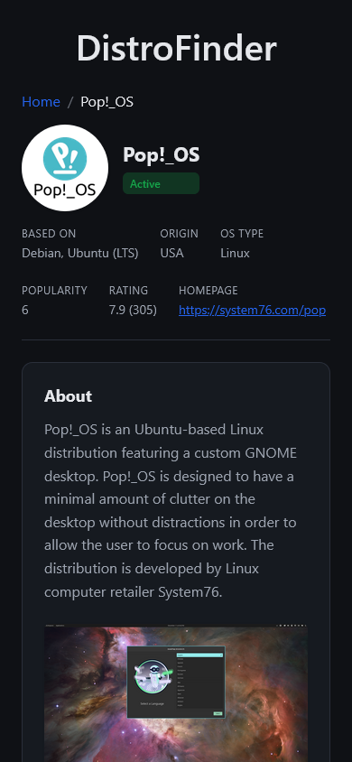
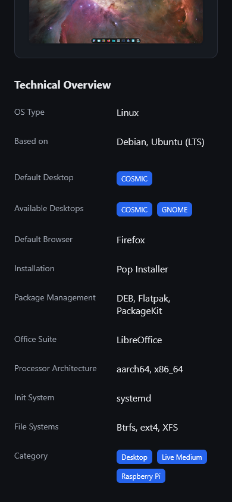

# DistroFinder


## 📚 Overview
DistroFinder is a frontend-only web application built with **React, TypeScript, and Vite** that allows users to explore information about Linux distributions in a clean, fast, and visually consistent way.

The app focuses on **discoverability, clarity, and editorial-style presentation**, making it easy to browse distros, inspect their details, and navigate between related information.

> **Note**: DistroFinder is intentionally frontend-only. All data is loaded from static JSON files and images served as static assets.

---







|  |  |  |
|---|---|---|

## ✨ Features

### 🗂️ Distro Grid (Home)

* Displays a grid of Linux distributions
* Each distro is represented by a card with:
  * Thumbnail image
  * Name
  * Short description
  * Status indicator
* Client-side search
* Client-side filtering via select controls (Desktop, Category)
* Filters and search are synced with URL query parameters
* Fully static data source (no backend)

### 📄 Distro Detail Page

* Dedicated detail page per distro (`/d/:slug`)
* Editorial-style layout with clear hierarchy:
  * Hero section with logo, name, and status
  * About section with description and screenshot
  * Technical overview with structured metadata
* Clickable Desktop and Category tags that:
  * Navigate back to Home
  * Apply the corresponding filter automatically
* Breadcrumb navigation (`Home / Distro Name`)
* Fully responsive (mobile-first)
* Dark mode support via CSS variables

### ↔️ Distro Comparison Page

* Side-by-side comparison of multiple distros
* Comparison table with key attributes
* Accessible via URL with query parameters (e.g. `/?compare=ubuntu,mint`)
* Clickable links to remove distros from comparison

### 🧭 Distro Recommendation Wizard

* Interactive wizard that recommends distributions based on your needs (`/wizard`)
* Accessible from the Home page via the recommendation callout/button
* Steps collected by the wizard:
  - Experience level (beginner, intermediate, advanced)
  - Primary use cases (multiple selection)
  - Hardware profile (older computer, Raspberry Pi, server, etc.)
  - Priorities / philosophy (ease-of-use, privacy, stability, performance, free-software)
  - Preferred desktop environment and other options for intermediate/advanced users
* The wizard scores distros client-side against your answers and presents a ranked list with short reasons for each recommendation
* State is persisted locally (so you can resume the wizard), and the logic is implemented in `src/utils/scoring.ts` and `src/utils/wizardStorage.ts`.
* Use the result list to jump to distro detail pages.


### 🎨 Design System

* Custom design system based on **CSS variables** (no Tailwind)
* Light and dark themes
* Reusable UI primitives:
  * Tag
  * StatusBadge
  * DefinitionRow
  * RadioGroup
* Consistent spacing, typography, and color tokens

---

## 🧱 Project Structure

```
src/
├── components/
│   ├── compare/          # Comparison-specific components
│   ├── distro/           # Distro-specific components
│   ├── layout/           # Layout-level components
│   │── routing/          # Routing-related components
│   ├── tags/             # Domain-aware clickable tags
│   ├── ui/               # Reusable UI primitives
│   └── wizard/           # Recommendation wizard components
├── context/
│   └── DistroContext.tsx # Global state & data access
├── data/
│   └── distroServices.ts # Data fetching utilities
├── hooks/
│   └── useDebouncedSearch.ts
├── pages/
│   ├── ComparePage.tsx   # Comparison page
│   ├── DistroDetail.tsx  # Detail page
│   └── Home.tsx          # Home page
├── styles/
│   ├── global.css        # Design tokens & global styles
│   └── ...
├── test/                 # Test utilities & mocks
├── types/
│   └── distro.ts         # TypeScript types for distros
├── utils/
│   └── filters.ts        # Filtering & search utilities
├── App.tsx
└── main.tsx
```

---

## 📦 Data Model

Each Linux distribution is defined in JSON and enforced via TypeScript types. Example:

```json
{
  "slug": "mint",
  "name": "Linux Mint",
  "lastUpdate": "2026-01-17 13:48",
  "description": "Linux Mint is an Ubuntu-based distribution...",
  "homepage": "https://linuxmint.com/",
  "osType": "Linux",
  "basedOn": "Debian (Stable), Ubuntu (LTS)",
  "origin": "Ireland",
  "architecture": "i686, x86_64",
  "desktop": "Cinnamon, MATE, Xfce",
  "category": "Beginners, Desktop, Live Medium",
  "status": "Active",
  "defaultDesktop": "Cinnamon, MATE, Xfce",
  "installation": "mintinstall",
  "defaultBrowser": "Firefox",
  "packageManagement": "DEB, Flatpak",
  "releaseModel": "Fixed",
  "officeSuite": "LibreOffice",
  "processorArchitecture": "x86_64",
  "initSystem": "systemd",
  "fileSystems": "Btrfs, ext4, XFS",
  "popularity": 2,
  "rating": 8.8,
  "reviewCount": 975,
  "slug": "mint",
  "name": "Linux Mint",
  "logo": "...",
  "screenshot": "...",
  "thumbnail": "...",
  "localPaths": {
    "logo": "...",
    "screenshot": "...",
    "thumbnail": "..."
  }
}
```

Images (logos, thumbnails, screenshots) are served as static assets.

---

## 🚀 Getting Started

### Prerequisites
* Node.js 18+
* npm or pnpm

### Install dependencies
```bash
npm install
```

### Run the development server
```bash
npm run dev
```

The app will be available at:
```
http://localhost:5173
```

### Build for production
```bash
npm run build
```

---

## 🌗 Theming & Dark Mode

* Dark mode is implemented using CSS variables
* Theme switching is handled at the root level
* No duplicated styles between light/dark modes

---

## 🔍 Routing

* `/` → Distro grid (home)
* `/d/:slug` → Distro detail page
* `/?compare=:slug1,:slug2` → Distro compare page
* `/wizard` → Distro recommendation wizard

React Router is used for client-side navigation.

---

## ❌ What Is *Not* Included (By Design)

* No backend
* No authentication
* No server-side rendering
* No analytics

The app is intentionally simple, fast, and easy to reason about.

---

## 🔮 Future Improvements

The following features are good candidates for future iterations:

### UI / UX

* Facet-based filtering UI (tags with counts)
* Collapsible filter sidebar on mobile
* Active filter summary bar
* Keyboard navigation improvements

### Data & Content

* Release history timeline
* External links (official website, docs)
* Screenshots gallery

### Performance

* Virtualized grid for very large datasets
* Image lazy-loading optimizations

### Developer Experience

* Unit tests for selectors and utilities
* Storybook for UI components
* Linting and formatting rules

---

## 🛠️ Technologies Used
* [React](https://reactjs.org/) - UI library
* [TypeScript](https://www.typescriptlang.org/) - Static typing
* [Vite](https://vitejs.dev/) - Build tool
* [React Router](https://reactrouter.com/) - Client-side routing

---

## 🤝 Contributing
Contributions are welcome! Feel free to open issues or submit pull requests on GitHub.

---

## 📄 License

DistroFinder is licensed under the [MIT License](LICENSE).
Feel free to use, modify, and distribute it as you see fit!
